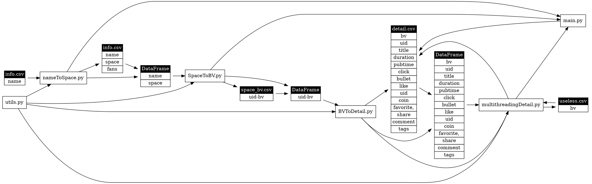

```graphviz
digraph G {
    rankdir=LR

    info1 [label=<<TABLE BORDER="0" CELLBORDER="1" CELLSPACING="0">
        <TR>
            <TD BGCOLOR="black"><FONT COLOR="white">info.csv</FONT></TD>
        </TR>
        <TR>
            <TD PORT="col1">name</TD>
        </TR>
    </TABLE>>, shape=none]
    nameToSpace [label="nameToSpace.py", shape=box]

    info1 -> nameToSpace

    info2 [label=<<TABLE BORDER="0" CELLBORDER="1" CELLSPACING="0">
        <TR>
            <TD BGCOLOR="black"><FONT COLOR="white">info.csv</FONT></TD>
        </TR>
        <TR>
            <TD PORT="col1">name</TD>
        </TR>
        <TR>
            <TD PORT="col2">space</TD>
        </TR>
        <TR>
            <TD PORT="col3">fans</TD>
        </TR>
    </TABLE>>, shape=none]

    nameToSpace -> info2

    df1 [label=<<TABLE BORDER="0" CELLBORDER="1" CELLSPACING="0">
        <TR>
            <TD BGCOLOR="black"><FONT COLOR="white">DataFrame</FONT></TD>
        </TR>
        <TR>
            <TD PORT="col1">name</TD>
        </TR>
        <TR>
            <TD PORT="col2">space</TD>
        </TR>
    </TABLE>>, shape=none]

    nameToSpace -> df1
    info2 -> df1

    SpaceToBV [label="SpaceToBV.py", shape=box]

    df1 -> SpaceToBV

    space_bv [label=<<TABLE BORDER="0" CELLBORDER="1" CELLSPACING="0">
        <TR>
            <TD BGCOLOR="black"><FONT COLOR="white">space_bv.csv</FONT></TD>
        </TR>
        <TR>
            <TD PORT="col1">uid-bv</TD>
        </TR>
    </TABLE>>, shape=none]

    SpaceToBV -> space_bv

    df2 [label=<<TABLE BORDER="0" CELLBORDER="1" CELLSPACING="0">
        <TR>
            <TD BGCOLOR="black"><FONT COLOR="white">DataFrame</FONT></TD>
        </TR>
        <TR>
            <TD PORT="col1">uid-bv</TD>
        </TR>
    </TABLE>>, shape=none]

    SpaceToBV -> df2
    space_bv -> df2

    BVToDetail [label="BVToDetail.py", shape=box]

    df2 -> BVToDetail

    detail [label=<<TABLE BORDER="0" CELLBORDER="1" CELLSPACING="0">
        <TR>
            <TD BGCOLOR="black"><FONT COLOR="white">detail.csv</FONT></TD>
        </TR>
        <TR>
            <TD PORT="col1">bv</TD>
        </TR>
        <TR>
            <TD PORT="col2">uid</TD>
        </TR>
        <TR>
            <TD PORT="col3">title</TD>
        </TR>
        <TR>
            <TD PORT="col4">duration</TD>
        </TR>
        <TR>
            <TD PORT="col5">pubtime</TD>
        </TR>
        <TR>
            <TD PORT="col6">click</TD>
        </TR>
        <TR>
            <TD PORT="col7">bullet</TD>
        </TR>
        <TR>
            <TD PORT="col8">like</TD>
        </TR>
        <TR>
            <TD PORT="col9">uid</TD>
        </TR>
        <TR>
            <TD PORT="col10">coin</TD>
        </TR>
        <TR>
            <TD PORT="col11">favorite,</TD>
        </TR>
        <TR>
            <TD PORT="col12">share</TD>
        </TR>
        <TR>
            <TD PORT="col13">comment</TD>
        </TR>
        <TR>
            <TD PORT="col14">tags</TD>
        </TR>
    </TABLE>>, shape=none]

    BVToDetail -> detail

    df3 [label=<<TABLE BORDER="0" CELLBORDER="1" CELLSPACING="0">
        <TR>
            <TD BGCOLOR="black"><FONT COLOR="white">DataFrame</FONT></TD>
        </TR>
        <TR>
            <TD PORT="col1">bv</TD>
        </TR>
        <TR>
            <TD PORT="col2">uid</TD>
        </TR>
        <TR>
            <TD PORT="col3">title</TD>
        </TR>
        <TR>
            <TD PORT="col4">duration</TD>
        </TR>
        <TR>
            <TD PORT="col5">pubtime</TD>
        </TR>
        <TR>
            <TD PORT="col6">click</TD>
        </TR>
        <TR>
            <TD PORT="col7">bullet</TD>
        </TR>
        <TR>
            <TD PORT="col8">like</TD>
        </TR>
        <TR>
            <TD PORT="col9">uid</TD>
        </TR>
        <TR>
            <TD PORT="col10">coin</TD>
        </TR>
        <TR>
            <TD PORT="col11">favorite,</TD>
        </TR>
        <TR>
            <TD PORT="col12">share</TD>
        </TR>
        <TR>
            <TD PORT="col13">comment</TD>
        </TR>
        <TR>
            <TD PORT="col14">tags</TD>
        </TR>
    </TABLE>>, shape=none]

    BVToDetail -> df3
    detail -> df3

    utils [label="utils.py", shape=box]

    multithreadingDetail [label="multithreadingDetail.py", shape=box]

    df3 -> multithreadingDetail
    BVToDetail -> multithreadingDetail

    useless [label=<<TABLE BORDER="0" CELLBORDER="1" CELLSPACING="0">
        <TR>
            <TD BGCOLOR="black"><FONT COLOR="white">useless.csv</FONT></TD>
        </TR>
        <TR>
            <TD PORT="col1">bv</TD>
        </TR>
    </TABLE>>, shape=none]

    multithreadingDetail -> useless
    useless -> multithreadingDetail
    multithreadingDetail -> detail
    
    utils -> nameToSpace
    utils -> SpaceToBV
    utils -> BVToDetail
    utils -> multithreadingDetail

    main [label="main.py", shape=box]

    nameToSpace -> main
    SpaceToBV -> main
    multithreadingDetail -> main

    main -> detail
}
```